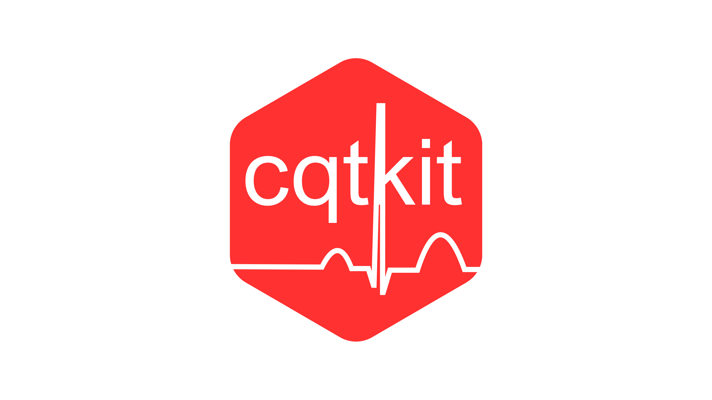

# cqtkit Documentation Site



[](https://starlight.astro.build)

This site contains the documentation for the [cqtkit](https://github.com/a2-ai/cqtkit) R package.

## Local Development

To run the documentation site locally:

```bash
# Install dependencies
npm install

# Start development server
npm run dev
```

## Documentation Updates

Documentation is generated from the package roxygen comments in cqtkit.

## Site structure

- `src/content/docs/reference` contains the reference material generated from the roxygen comments.
- `src/content/rd_docs` contains md files of the roxygen comments
- `src/content/docs/guides` will contain vignettes-esque guides
- `public` contains graphical output (tables/figures) of the package examples
- `src/assets/output` contains text-based output (dataframes) of the package examples

## Questions or Issues

For questions about the package please use the [package repository](https://github.com/a2-ai/cqtkit). For documentation site issues please open an issue in this repository
